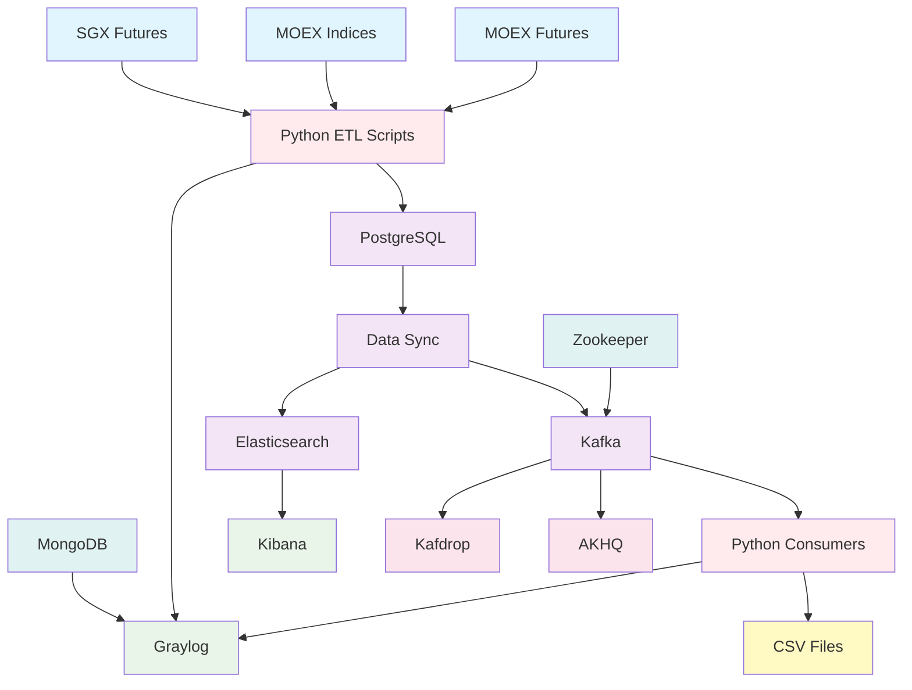

# QA Data Pipeline Portfolio

## 🎯 Цель проекта
Практическая реализация микросервисной архитектуры для демонстрации работы QA инженера с современным стеком технологий. Проект использует сбор данных с **Singapore Exchange** и **MOEX** как use-case для отработки полного цикла обработки данных в распределенной системе.

В основе проекта лежат мои отлаженные скрипты, которые успешно работали в продакшене более 1.5 лет. Я расширила их до полноценной системы, чтобы углубленно изучить:
- Работу QA инженера с микросервисной архитектурой  
- Современные DevOps-практики
- End-to-end тестирование data pipeline

**Почему микросервисы для простой задачи?**
Каждая технология в проекте представляет отдельный сервис с четкими границами ответственности.

## 🏗 Архитектура

### Архитектура поддерживает три независимых потока данных:

1. **Singapore Exchange** - товарные фьючерсы
2. **MOEX индексы** - российские рыночные индексы  
3. **MOEX фьючерсы** - зерновые и энергетические деривативы



## 🛠 Ключевые компетенции

### 🧪 Тестирование и обеспечение качества
- **Автоматизированное тестирование:** pytest, интеграция с CI/CD
- **Ручное тестирование:** сквозная проверка пайплайна данных
- **Интеграционное тестирование:** Kafka, Elasticsearch, PostgreSQL
- **Мониторинг производительности:** Docker контейнеров и системных метрик
- **Багрепортинг:** выявление, документирование и отслеживание дефектов

### 🎯 Покрытие тестирования

- **Автоматизированное тестирование БД** - здоровье, схема, производительность
- **Kafka Connectivity** - брокер, топики, мониторинг
- **Message Processing** - workflows продюсера/консьюмера
- **Data Validation** - формат данных, обязательные поля, обработка ошибок
- **Error Recovery** - сценарии перезапуска сервисов
- **Security** - санитизация данных и защита от инъекций
- **End-to-End тестирование** - полный цикл данных от API до CSV

### 🔧 Data Engineering & DevOps
- Проектирование и реализация end-to-end data pipeline
- Интеграция **разнородных источников данных** (SGX, MOEX индексы, MOEX фьючерсы)
- Контейнеризация и оркестрация сервисов (Docker, Docker Compose)
- Работа с message brokers (Apache Kafka) и потоковой обработкой данных
- Централизованное логирование и мониторинг (Graylog)

### 📊 Валидация данных и мониторинг
- Валидация данных на всех этапах пайплайна
- Мониторинг качества и целостности данных

## 📊 Elasticsearch & Kibana Integration

**Мониторинг данных в реальном времени через Kibana:**

- **Автоматическая синхронизация** данных из PostgreSQL в Elasticsearch
- **Визуализация** цен и объемов фьючерсов с **трех источников**
- **Логирование процессов** - детальные логи Python скриптов и Kafka Consumers
- **Centralized logging** - все логи в одном месте для отладки

### Доступные логи в Kibana:
- **main-script-logs** - workflow сбора данных с Singapore Exchange
- **moex-script-logs** - сбор данных с MOEX индексов
- **moex-futures-logs** - сбор данных с MOEX фьючерсов
- **kafka-consumer-logs** - обработка сообщений и экспорт в CSV
- **agriculture-data** - рыночные данные фьючерсов
### Пример фильтрации логов:

### Все успешные обработки сообщений
```bash
event_type: "kafka_message_processed"
```

### Ошибки в системе

```bash
level: "ERROR"
```

### Конкретный контракт

```bash
contract: "FEFZ25"
```

### Логи основного скрипта

```bash
logger: "main_script"
```

## 🔄 Apache Kafka Integration

**Обработка данных через multiple topics:**
- **market-data** - данные Singapore Exchange
- **moex-market-data** - данные MOEX индексов  
- **moex-futures-data** - данные MOEX фьючерсов

**Полный цикл:** Сбор → Обработка → Экспорт для всех источников

### Data Export Consumers:
- **kafka_consumer.py** - обработка SGX данных → `kafka_messages.csv`
- **kafka_consumer_moex.py** - обработка MOEX индексов → `kafka_messages_moex.csv`  
- **kafka_consumer_futures.py** - обработка MOEX фьючерсов → `kafka_messages_futures.csv`

## 🖥️ Kafka Monitoring with Kafdrop

**Визуальный мониторинг Kafka топиков**

- **Просмотр сообщений:** Чтение данных из топика `market-data` в формате JSON
- **Мониторинг топиков:** Информация о партициях, офсетах и репликации
- **Consumer groups:** Отслеживание работы консьюмеров

### Доступ к Kafdrop:
- **URL:** http://localhost:9000
- **Топик для просмотра:** `market-data`

### Пример данных в Kafdrop:
```json
{
  "id_value": 200.0,
  "date": "2025-09-19", 
  "price": 106.25,
  "contract": "FEFZ25",
  "name_rus": "Железная руда 62% Fe",
  "source": "moex_sgx"
}
```

## Как запустить

- git clone https://github.com/kholobtseva/my-docker-project.git

### Убедитесь, что скрипт запускается из папки проекта

### Автоматический запуск (Windows .bat файл)
```batch
@echo off
cd /d %~dp0
echo Запуск Docker Compose...
docker-compose up --build -d
echo Ожидание 45 секунд...
timeout /t 45
echo Настройка Graylog...
docker-compose exec python-script python app/setup_graylog.py
timeout /t 20
echo Запуск Python-скрипта...
docker-compose exec python-script python app/main.py
timeout /t 20
docker-compose exec python-script python app/main_moex.py
timeout /t 20
docker-compose exec python-script python app/main_moex_futures.py
echo. 
echo СКРИПТ ЗАВЕРШЕН - нажми любую клавишу для закрытия...
pause
```

### Доступ к интерфейсам:
- Kibana (визуализация): http://localhost:5601
- Elasticsearch (данные): http://localhost:9200  
- PostgreSQL (БД): http://localhost:5432
- Kafka (брокер): http://localhost:9092
- Kafdrop (мониторинг): http://localhost:9000
- AKHQ (управление и тестирование): http://localhost:8080
- Graylog (Централизованный сбор и анализ логов): http://localhost:9001

## Технологии

**Backend:**  
 
 
 

 


**UI Tools:**  
 *(управление + тестирование)*

## Мониторинг, аналитика и логирование:


##  Брокер сообщений (Message Broker):


## 🐳 Docker Image

**Автоматически собирается и публикуется на Docker Hub:**  
[](https://hub.docker.com/r/kholobtseva/my-python-script)
[](https://hub.docker.com/r/kholobtseva/my-python-script/tags)

### Использование готового образа:

docker pull kholobtseva/my-python-script:latest  
docker run -d kholobtseva/my-python-script:latest

## 🚀 CI/CD Pipeline


Проект использует **полный цикл CI/CD** на GitHub Actions:

### ✅ Непрерывная интеграция Continuous Integration (CI)
- **47 тестов** на pytest:
  - Unit-тесты компонентов
  - Тест-документация процессов и workflow
  - Проверка зависимостей и структуры проекта  
  - Валидация Dockerfile и конфигураций

### 🚀 Непрерывная поставка Continuous Delivery (CD) 
- **Автоматическая сборка** Docker образа при каждом коммите
- **Публикация в Docker Hub** с тегами latest и 1.0
- **Версионирование** образов для возможности отката

### 🔄 Поток обработки данных (Data Pipeline)
**Полный цикл обработки данных:**
- ✅ **Data Collection:** Сбор данных с Singapore Exchange API
- ✅ **Database:** Сохранение в PostgreSQL с автоматическим созданием схемы
- ✅ **Search & Analytics:** Синхронизация в Elasticsearch для полнотекстового поиска
- ✅ **Real-time Processing:** Отправка в Apache Kafka для потоковой обработки
- ✅ **Data Export:** Консюмер сохраняет данные в CSV для анализа
- ✅ **Monitoring:** Визуализация в Kibana
  
### 📊 Мониторинг
- **Автоматические email-уведомления** о результатах CI/CD
- **Визуальный статус** через бейджи в README  
- **Детальные логи** в GitHub Actions
- **Полная история** всех запусков

### 📋 Централизованный сбор и анализ логов с помощью Graylog

**Автоматическая настройка логирования:**
- GELF UDP Input на порту 12201
- Логи из Python скриптов и Kafka consumer
- Централизованный сбор и анализ логов

**Доступ:** http://localhost:9001
- Логин: `admin`
- Пароль: `admin`

**Что логируется:**
- Сбор данных с Singapore Exchange API и MOEX ISS
- Синхронизация с Elasticsearch
- Обработка сообщений Kafka
- Ошибки и системные события

## 🔧 Устранение неполадок

**Распространенные проблемы:**
- **Нет подключения к Kafka**: Проверьте что все контейнеры запущены: `docker-compose ps`
- **Нет сообщений в топике**: Убедитесь что producer отправляет данные, проверьте логи: `docker-compose logs python-script`
- **CSV файл не обновляется**: Проверьте логи consumer: `docker-compose logs kafka-consumer`

## 🧪 Тестирование (основной фокус)

### Установить зависимости
pip install -r requirements.txt

### Запустить все тесты (47 тестов - код + документация)
pytest tests/ -v

### Запустить конкретные тесты
- pytest tests/test_ci.py -v
- pytest tests/test_simple.py -v

### Система отчетности ручного тестирования Kafka

#### Allure Reports - Документирование процесса
```bash
pytest tests/ --alluredir=allure-results
allure serve allure-results
```
- Тест-кейсы в Allure служат для удобного просмотра структуры тестирования в одном месте  
- Прикрепленные артефакты: скриншоты, логи, JSON сообщения с привязкой к шагам тест-кейсов  
- Фактически это документация процесса ручного тестирования, а не автоматические тесты  

---

**Реальные результаты**

**📊 [Markdown Report с реальными результатами тестирования Kafka](quality-assurance/test_results/kafka_pipeline_suite_report.md)**

**📊 [Markdown Report с реальными результатами тестирования Elasticsearch](quality-assurance/test_results/elasticsearch_pipeline_suite_report.md)**

**📊 [Markdown Report с реальными результатами тестирования базы данных](quality-assurance/test_results/data_base_suite_report.md)**

### Ручное тестирование Kafka
- **Kafdrop**: Мониторинг топиков и сообщений (http://localhost:9000)
- **AKHQ**: Полнофункциональный интерфейс Kafka с отправкой сообщений (http://localhost:8080)
- **Ручное тестирование**: Отправка тестовых сообщений для проверки пайплайна данных.

### Пример сообщения для тестирования Kafka:
```json
{
  "id_value": 999,
  "date": "2024-01-15",
  "price": 150.75,
  "contract": "MANUAL_TEST",
  "name_rus": "Тест ручного QA",
  "source": "manual_test"
}

```
## 📊 Allure отчеты о тестировании

### 🚀 Онлайн отчет (GitHub Pages)
После каждого коммита актуальный тестовый отчет автоматически публикуется:  
**👉 https://kholobtseva.github.io/my-docker-project/**

### 💻 Локальный отчет
Для генерации и просмотра отчетов локально:

### Запустить тесты с Allure
```bash
pytest tests/ --alluredir=allure-results
```
### Просмотреть отчет в браузере
```bash
allure serve allure-results
```
### 📋 Что включено в отчет
- **47 тестов** (unit-тесты, авто тесты базы данных и тест-документация процессов)
- **Реальные доказательства тестирования:** логи, скриншоты, JSON сообщения


