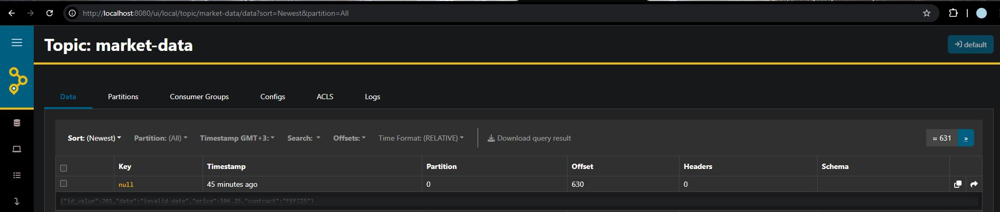

### БАГ: Отсутствие валидации формата даты в Kafka Consumer

**ID бага:** BUG-KAFKA-006  
**Заголовок:** Consumer принимает и обрабатывает сообщения с невалидным форматом даты без проверки  
**Серьезность:** Высокая  
**Приоритет:** Высокий  
**Компонент:** Kafka Consumer (kafka_consumer.py)  
**Окружение:** Docker контейнеры, Kafka пайплайн

**Описание:**  
Kafka consumer обрабатывает сообщения с невалидным форматом даты "invalid-date" без какой-либо валидации или предупреждений. Невалидная дата принимается и сохраняется в CSV файл без обработки ошибок.

**Шаги воспроизведения:**
1. Отправить сообщение с невалидной датой через AKHQ:
   ```json
   {"id_value":201,"date":"invalid-date","price":106.25,"contract":"FEFZ25"}
   ```
2. Проверить логи consumer.
   ```bash
   docker-compose logs kafka-consumer --tail=20 > quality-assurance/test_results/TC-KAFKA-006_step2_consumer_logs.txt
   ```
   
4. Проверить содержимое CSV файла.  
 
**Ожидаемый результат:**
- Consumer должен проверять формат даты.
- Логировать предупреждение о невалидном формате даты.
- Опционально отклонять или помечать невалидные сообщения.

**Фактический результат:**
- Сообщение обработано без предупреждений о валидации
- Невалидная дата "invalid-date" сохранена в CSV
- Логи consumer показывают нормальную обработку: `RECEIVED Message #631: FEFZ25 - invalid-date`

**Доказательства:**


- Отправка сообщения с невалидной датой
[Логи consumer](../test_results/TC-KAFKA-006_step2_consumer_logs.txt)
 - Отсутствие предупреждений о валидации
- CSV содержит невалидную дату: `FEFZ25;invalid-date;106.25`

**Влияние:**
Проблемы целостности данных, потенциальные проблемы в downstream системах, которые полагаются на валидные форматы дат.

**Предлагаемое решение:**
Добавить валидацию формата даты в функцию `validate_payload()` в `kafka_consumer.py`
