## 🧪 Test Case Results
✅ PASS - все ок  
❌ FAIL - тест не прошел  

### TC-DB-001: Подключение к базе данных и базовые операции

| Шаг | Действие | Ожидаемый результат | Фактический результат | Статус | Доказательства |
|-----|----------|---------------------|----------------------|--------|----------------|
| 1 | Проверить доступность PostgreSQL | PostgreSQL доступен | ✅ PostgreSQL accepting connections | PASS | 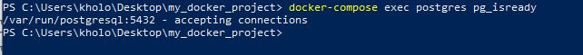 |
| 2 | Проверить список таблиц | Отображается список таблиц | ✅ 3 таблицы отображаются | PASS | 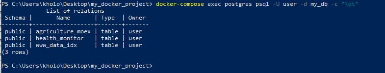 |
| 3 | Проверить существование основных таблиц | Все основные таблицы существуют | ✅ Все 3 таблицы найдены | PASS | 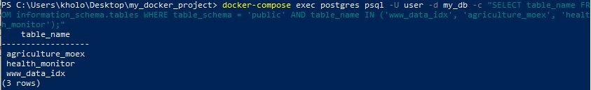 |
| 4 | Проверить количество записей | Таблица содержит записи (COUNT > 0) | ✅ 65 записей в таблице | PASS | 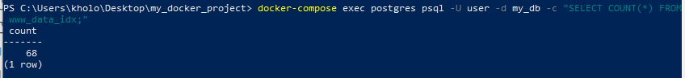 |

**Статус:** ✅ Manual ✅ PASSED

---

### TC-DB-002: Проверка целостности данных и ограничений

| Шаг | Действие | Ожидаемый результат | Фактический результат | Статус | Доказательства |
|-----|----------|---------------------|----------------------|--------|----------------|
| 1 | Проверить UNIQUE constraint в agriculture_moex | Нет дубликатов по UNIQUE constraint | ✅ 0 дубликатов найдено | PASS | 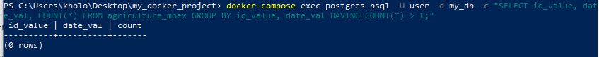 |
| 2 | Проверить PRIMARY KEY в www_data_idx | Нет дубликатов PRIMARY KEY | ✅ 0 дубликатов PRIMARY KEY | PASS | 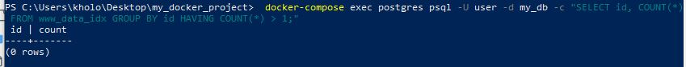 |
| 3 | Проверить что все обязательные поля заполнены | Все обязательные поля содержат значения (COUNT = 0) | ✅ 0 записей с NULL значениями | PASS | 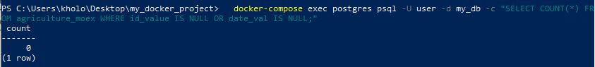 |

**Статус:** ✅ Manual ✅ PASSED

---

### TC-DB-003: Проверка механизма ON CONFLICT

| Шаг | Действие | Ожидаемый результат | Фактический результат | Статус | Доказательства |
|-----|----------|---------------------|----------------------|--------|----------------|
| 1 | Выбрать существующую запись | Возвращает существующую запись | ✅ Запись найдена: id_value=198, date_val=2025-07-23 | PASS | 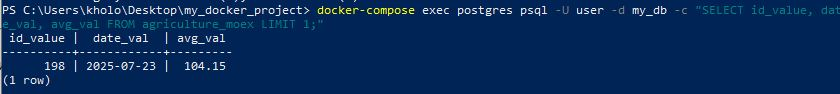 |
| 2 | Вставить дубликат с ON CONFLICT | Не возникает ошибки UNIQUE violation | ✅ INSERT 0 1 - запись обновилась | PASS | 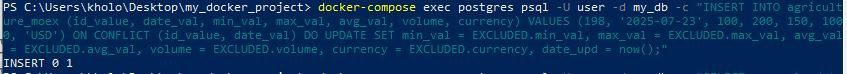 |
| 3 | Проверить обновление записи | avg_val=150, date_upd обновился | ✅ avg_val=150, date_upd=2025-10-09 16:36:22 | PASS | 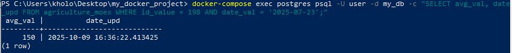 |

**Статус:** ✅ Manual ✅ PASSED

---

### TC-DB-004: Проверка операций обновления данных

| Шаг | Действие | Ожидаемый результат | Фактический результат | Статус | Доказательства |
|-----|----------|---------------------|----------------------|--------|----------------|
| 1 | Проверить текущее значение health_status | health_status = 100 | ✅ health_status = 100 | PASS | 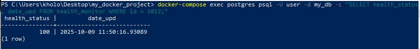 |
| 2 | Выполнить обновление health_status | UPDATE выполняется без ошибок | ✅ UPDATE 1 - успешно | PASS | 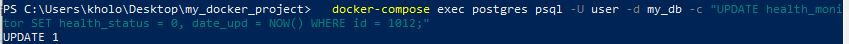 |
| 3 | Проверить обновление health_status | health_status = 0 | ✅ health_status = 0 | PASS | 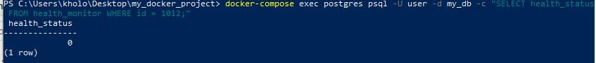 |
| 4 | Обновить запись в agriculture_moex | Цена успешно обновляется | ✅ Цена обновлена на 999 | PASS | 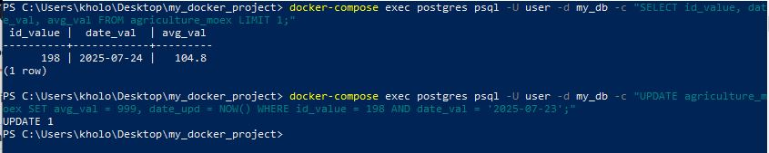 |
| 5 | Восстановить исходные значения | Исходные значения восстановлены | ✅ health_status=100, цена восстановлена | PASS | 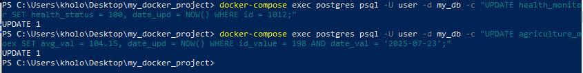 |

**Статус:** ✅ Manual ✅ PASSED

---

### TC-DB-005: Query Performance and Data Retrieval

| Шаг | Действие | Ожидаемый результат | Фактический результат | Статус | Доказательства |
|-----|----------|---------------------|----------------------|--------|----------------|
| 1 | Проверить время выполнения базового запроса | Запрос выполняется быстро (< 100ms) | ✅ Execution Time: 0.347 ms | PASS | 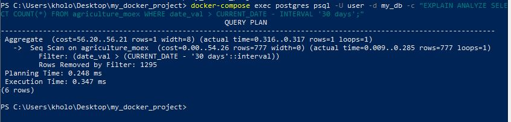 |
| 2 | Проверить запрос с JOIN | Запрос выполняется за разумное время (< 1 секунды) | ✅ Execution Time: 0.692 ms | PASS | 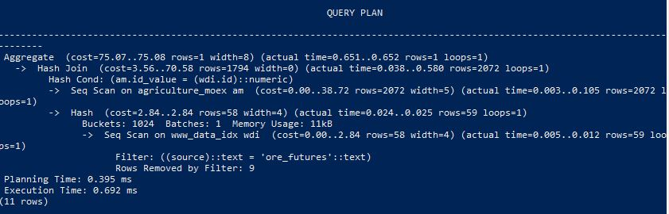 |
| 3 | Проверить что запросы выполняются за разумное время | Оба запроса < 1 секунды | ✅ Query1: 0.142ms, Query2: 0.696ms | PASS | 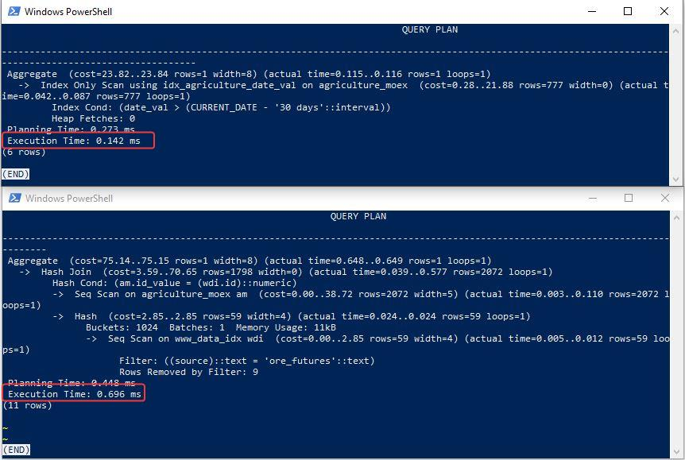 |

**Статус:** ✅ Manual ✅ PASSED

---

### TC-DB-006: Complex JOIN Queries Validation

| Шаг | Действие | Ожидаемый результат | Фактический результат | Статус | Доказательства |
|-----|----------|---------------------|----------------------|--------|----------------|
| 1 | JOIN запрос с названиями фьючерсов | Запрос выполняется без ошибок | ✅ 5 записей с русскими названиями | PASS |  |
| 2 | JOIN запрос с агрегацией | Агрегатные функции работают | ✅ COUNT и AVG возвращают данные | PASS |  |

**Статус:** ✅ Manual ✅ PASSED
