## 🧪 Test Case Results
✅ PASS - все ок  
❌ FAIL - тест не прошел  

### TC-ES-001: Elasticsearch Service Connectivity

| Шаг | Действие | Ожидаемый результат | Фактический результат | Статус | Доказательства |
|-----|----------|---------------------|----------------------|--------|----------------|
| 1 | Проверить статус Elasticsearch | Status: "green" или "yellow" | ✅ Status: "yellow" (норма для single-node) | PASS |  |
| 2 | Проверить список индексов | Отображается список индексов | ✅ Индекс agriculture-data присутствует | PASS | 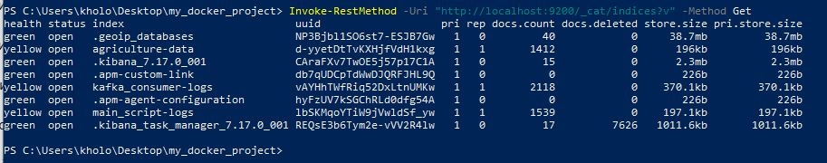 |
| 3 | Проверить количество документов | Индекс содержит данные | ✅ 1412 документов в индексе | PASS | 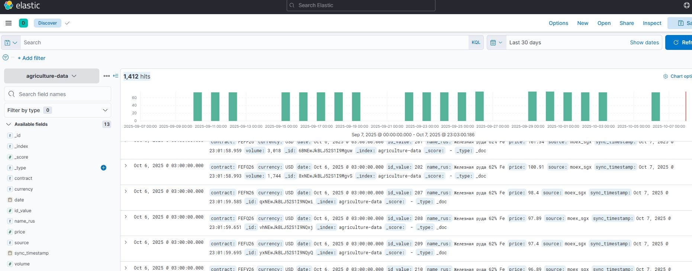 |

**Статус:** ✅ Manual ✅ PASSED

---

### TC-ES-002: PostgreSQL to Elasticsearch Data Synchronization

| Шаг | Действие | Ожидаемый результат | Фактический результат | Статус | Доказательства |
|-----|----------|---------------------|----------------------|--------|----------------|
| 1 | Проверить данные в Kibana Discover | Данные отображаются, все поля присутствуют | ✅ Данные отображаются, все поля присутствуют | PASS | 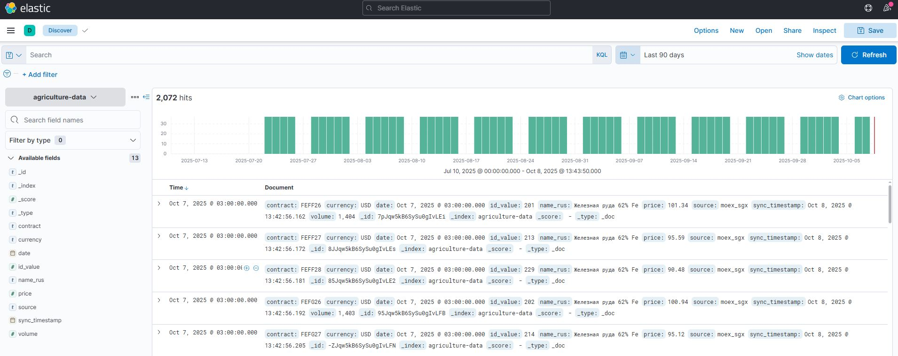 |
| 2 | Проверить детали документа | Документ содержит все обязательные поля | ✅ Все поля присутствуют: id_value, date, price, contract, name_rus, source, sync_timestamp | PASS |  |
| 3 | Проверить количество документов | Количество документов > 0 | ✅ 1412 документов в индексе | PASS | 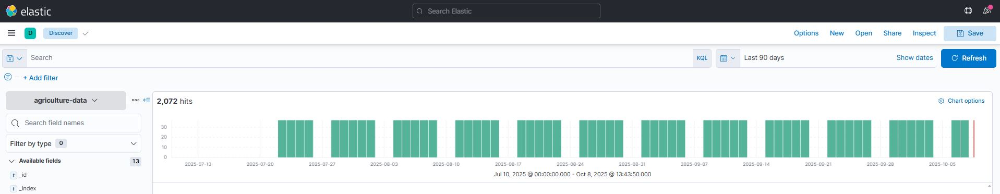 |
| 4 | Сравнить с PostgreSQL | Количество в PostgreSQL ≈ количеству в ES | ✅ PostgreSQL: 2072 записей = ES: 2072 документов | PASS | 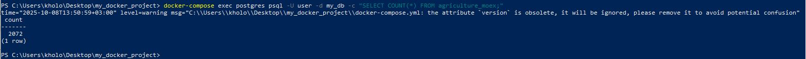 |

**Статус:** ✅ Manual ✅ PASSED

---

### TC-ES-003: Elasticsearch Search and Query Testing

| Шаг | Действие | Ожидаемый результат | Фактический результат | Статус | Доказательства |
|-----|----------|---------------------|----------------------|--------|----------------|
| 1 | Поиск по названию контракта FEFZ25 через Kibana Discover | Отображаются только документы с contract: FEFZ25 | ✅ Найдены документы с contract: FEFZ25 | PASS | 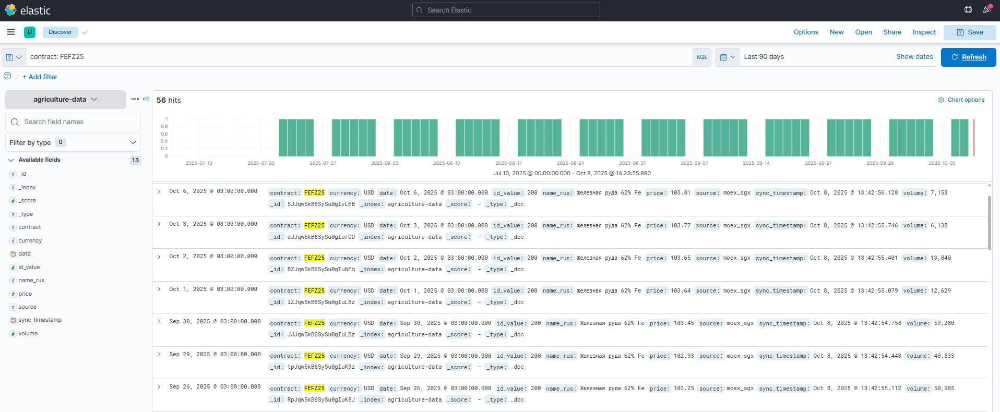 |
| 2 | Поиск по диапазону цен 100-200 через Kibana Discover | Отображаются документы с price в диапазоне 100-200 | ✅ Найдены документы в указанном диапазоне цен | PASS | 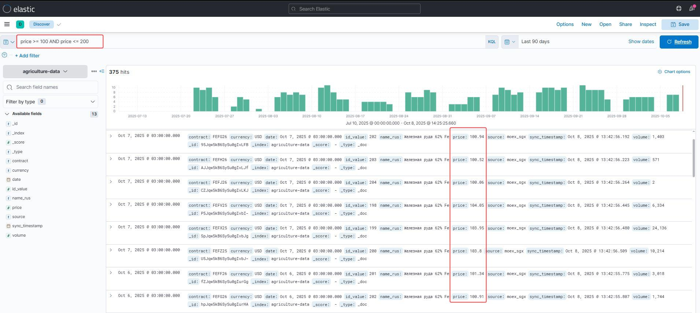 |
| 3 | Показать изменение объема торгов по дням через Kibana Visualize | Area chart показывает динамику объема торгов во времени | ✅ Area chart отображает изменение volume по датам | PASS | 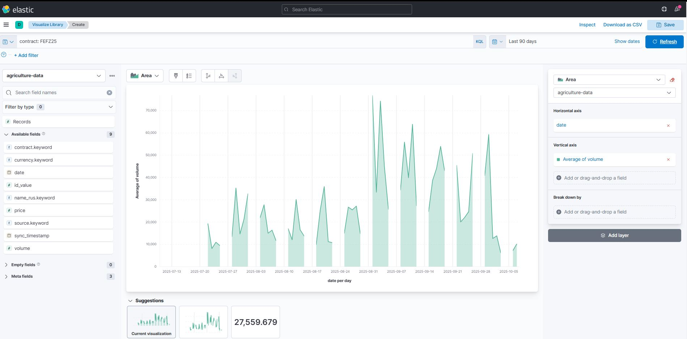 |
| 4 | Поиск по русскому тексту через Kibana Discover | Отображаются документы с name_rus содержащим "железная" | ✅ Найдены документы с русским текстом | PASS | 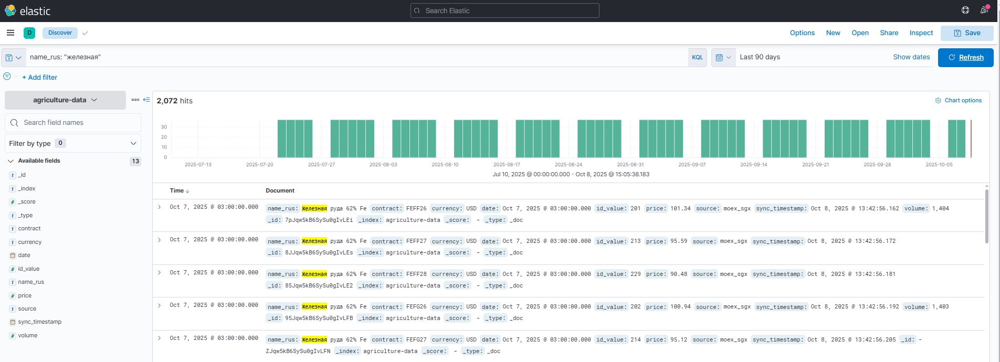 |

**Статус:** ✅ Manual ✅ PASSED

---

### TC-ES-004: Elasticsearch Service Recovery

| Шаг | Действие | Ожидаемый результат | Фактический результат | Статус | Доказательства |
|-----|----------|---------------------|----------------------|--------|----------------|
| 1 | Остановить Elasticsearch контейнер | Контейнер останавливается |  |  |  |
| 2 | Проверить ошибки подключения в Kibana | Kibana показывает ошибки подключения |  |  | 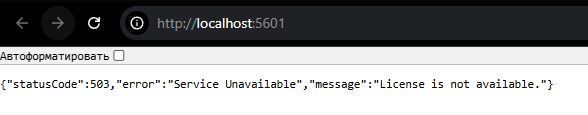 |
| 3 | Запустить Elasticsearch контейнер | Контейнер запускается |  |  |  |
| 4 | Проверить статус Elasticsearch после запуска | Status: "green" или "yellow" |  |  |  |
| 5 | Проверить восстановление Kibana | Kibana работает нормально |  |  | 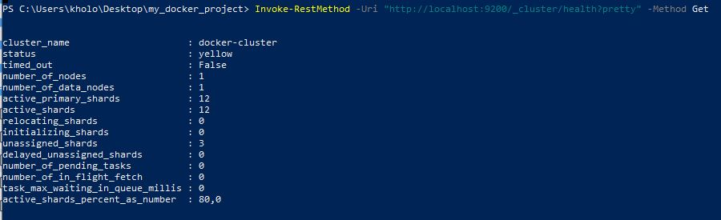 |
| 6 | Проверить целостность данных после восстановления | Количество документов сохранилось |  |  | 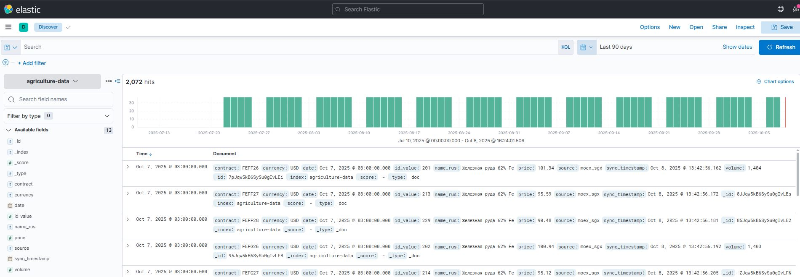 |

**Статус:** ✅ Manual ✅ 

