# Test Suite Report: Kafka Data Pipeline

## 📊 Executive Summary
- **Test Suite**: Kafka Data Pipeline  
- **Execution Date**: 
- **Total Test Cases**: 
- **Passed**: 
- **Failed**:  
- **Blocked**: 
- **Bugs Found**: 

---

## 🧪 Test Case Results

### TC-KAFKA-001: Basic Kafka Connectivity

| Шаг | Действие | Ожидаемый результат | Фактический результат | Статус | Доказательства |
|-----|----------|---------------------|----------------------|--------|----------------|
| 1 | `docker-compose ps` | Все контейнеры "Up" | ✅ Все контейнеры запущены | PASS | 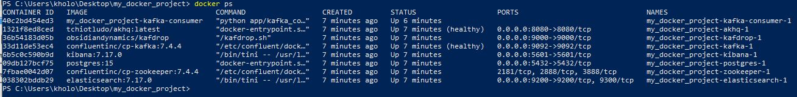 |
| 2 | `docker-compose exec kafka...` | Топик market-data существует | ✅ Топик найден | PASS | 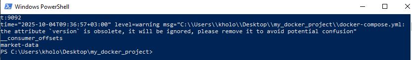 |
| 3 | Открыть Kafdrop | Интерфейс доступен | ✅ Kafdrop открыт | PASS |  |

**Статус:** ✅ Manual ✅ PASSED
---
### TC-KAFKA-002: Manual Message Producing via AKHQ

| Шаг | Действие | Ожидаемый результат | Фактический результат | Статус | Доказательства |
|-----|----------|---------------------|----------------------|--------|----------------|
| 1 | Открыть AKHQ | Интерфейс AKHQ открывается | ✅ AKHQ доступен | PASS | 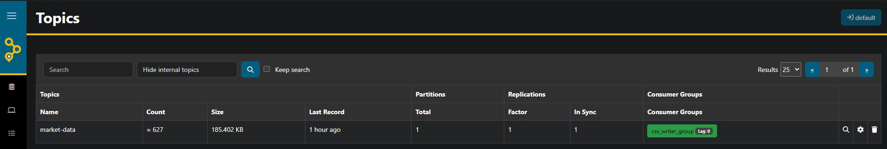 |
| 2 | Перейти в топик market-data | Отображается страница топика | ✅ Топик найден | PASS | 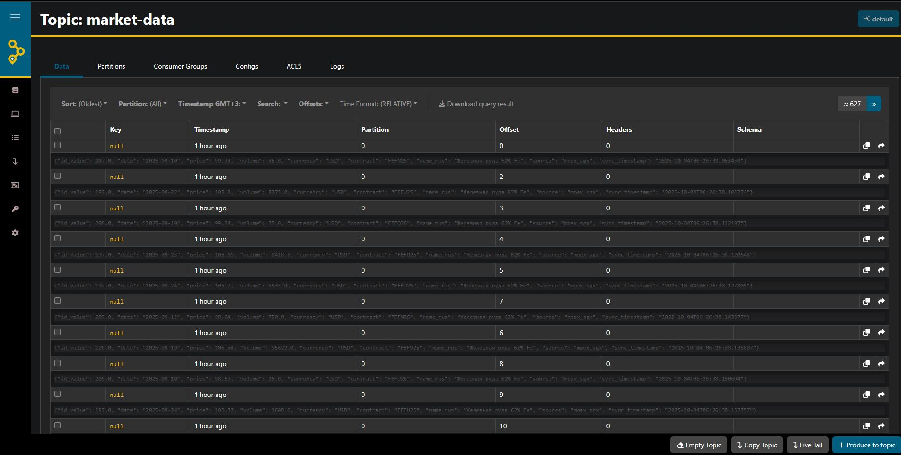 |
| 3 | Нажать "Produce message" | Открывается форма отправки | ✅ Форма открыта | PASS | 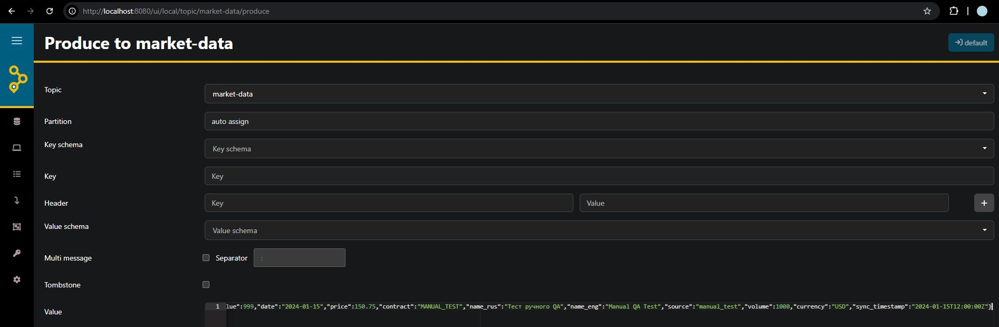 |
| 4 | Ввести и отправить сообщение | Сообщение успешно отправлено | ✅ Сообщение отправлено | PASS | 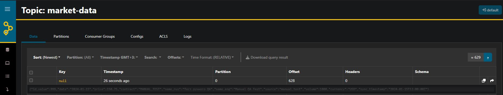 |

**Статус:** ✅ Manual ✅ PASSED
---
### TC-KAFKA-003: Consumer Data Processing and CSV Export

| Шаг | Действие | Ожидаемый результат | Фактический результат | Статус | Доказательства |
|-----|----------|---------------------|----------------------|--------|----------------|
| 1 | Отправить тестовое сообщение через AKHQ | Сообщение появляется в топике market-data | ✅ Сообщение успешно отправлено | PASS | 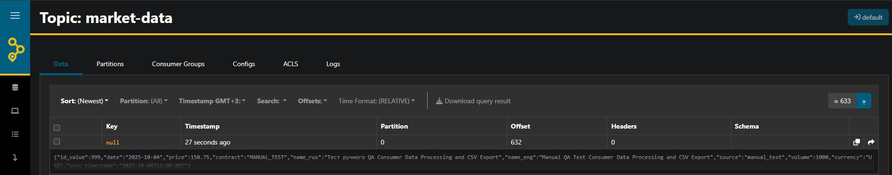 |
| 2 | Проверить логи consumer | В логах присутствует запись о получении сообщения | ✅ Consumer получил сообщение | PASS | [Логи](../test_results/TC-KAFKA-003_step2_consumer_logs.txt) |
| 3 | Проверить создание CSV файла | CSV файл существует в папке /app/logs/ | ✅ Файл создан | PASS | [Проверка](../test_results/TC-KAFKA-003_step3_csv_file_check.txt) |
| 4 | Проверить содержимое CSV файла | Файл содержит данные отправленного сообщения | ✅ Данные присутствуют | PASS | 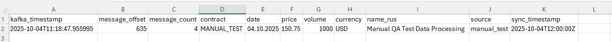 |
| 5 | Проверить нормализацию данных | Все поля корректно нормализованы | ✅ Проблема с кириллицей в name_rus | WARNING | [Нормализация](../test_results/TC-KAFKA-003_step5_data_normalization.txt) |

**Статус:** ✅ Manual ✅ PASSED
---
### TC-KAFKA-004: Kafka Service Recovery After Restart

| Шаг | Действие | Ожидаемый результат | Фактический результат | Статус | Доказательства |
|-----|----------|---------------------|----------------------|--------|----------------|
| 1 | Остановить Kafka брокер | Kafka контейнер останавливается | ✅ Kafka успешно остановлен | PASS | [Статус](../test_results/TC-KAFKA-004_step1_all_containers_status.txt) |
| 2 | Запустить python-script при недоступном Kafka | Скрипт запускается, но не может подключиться к Kafka | ✅ Скрипт запущен, ошибки подключения | PASS | [Логи](../test_results/TC-KAFKA-004_step2_python_script_logs.txt) |
| 3-4 | Проверить логи на ошибки подключения | Найдены ошибки: DNS failed, NoBrokersAvailable | ✅ Все ошибки найдены в логах | PASS | [Анализ логов](../test_results/TC-KAFKA-004_step2_python_script_logs.txt) |
| 5 | Запустить Kafka обратно | Kafka контейнер запускается | ✅ Kafka запущен и healthy | PASS | [Статус](../test_results/TC-KAFKA-004_step5_kafka_started.txt) |
| 6 | Подождать 30 секунд | Соединение восстанавливается | ✅ Соединение восстановлено | PASS | - |
| 7 | Отправить тестовое сообщение через AKHQ | Сообщение успешно отправляется в топик | ✅ Сообщение отправлено | PASS | 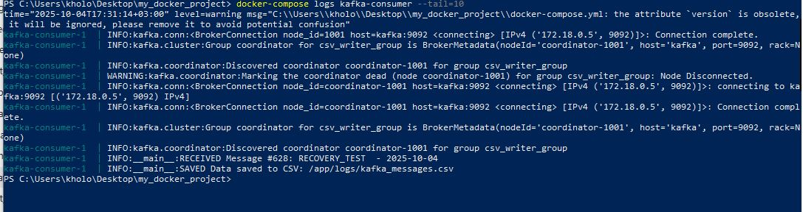 |
| 8 | Проверить обработку consumer | Consumer обрабатывает новое сообщение | ✅ Сообщение #628 получено и сохранено | PASS | [Логи](../test_results/TC-KAFKA-004_step8_consumer_processing.txt) |

**Статус:** ✅ Manual ✅ PASSED
---
### TC-KAFKA-005: Valid Message Processing

| Шаг | Действие | Ожидаемый результат | Фактический результат | Статус | Доказательства |
|-----|----------|---------------------|----------------------|--------|----------------|
| 1 | Отправить валидное сообщение через AKHQ | Сообщение успешно отправлено в топик market-data | Сообщение успешно отправлено в топик | ✅ PASS | 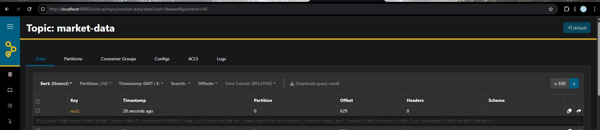 |
| 2 | Проверить логи consumer | В логах consumer есть запись об обработке сообщения | Сообщение #630 обработано: FEFZ25 - 2025-10-04 | ✅ PASS | [Логи](../test_results/TC-KAFKA-005_step2_consumer_logs.txt) |
| 3 | Проверить данные CSV файла | CSV файл содержит данные отправленного сообщения | Данные сохранены в CSV: /app/logs/kafka_messages.csv | ✅ PASS | [Содержимое CSV](../test_results/TC-KAFKA-005_step3_csv_content.txt) 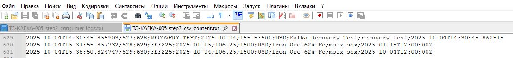 |

Status: ✅ Manual ✅ PASSED
---

### TC-KAFKA-006: Invalid Date Format Handling

| Шаг | Действие | Ожидаемый результат | Фактический результат | Статус | Доказательства |
|-----|----------|---------------------|----------------------|--------|----------------|
| 1 | Отправить сообщение с невалидной датой через AKHQ | Сообщение успешно отправлено в топик market-data | Сообщение успешно отправлено в топик | ✅ PASS |  |
| 2 | Проверить логи consumer на предупреждения о валидации | В логах consumer есть предупреждения о невалидном формате даты | Предупреждений нет - невалидная дата принята без ошибок | ❌ FAIL | [Логи](../test_results/TC-KAFKA-006_step2_consumer_logs.txt) |

**Статус:** ✅ Manual ❌ FAILED - Отсутствует валидация даты (Баг BUG-KAFKA-006)  
**Ссылка на баг:** BUG-KAFKA-006_missing_date_validation.md

---

### TC-KAFKA-007: Required Field Validation

| Шаг | Действие | Ожидаемый результат | Фактический результат | Статус | Доказательства |
|-----|----------|---------------------|----------------------|--------|----------------|
| 1 | Отправить сообщение без обязательного поля "price" через AKHQ | Сообщение успешно отправлено в топик market-data | Сообщение успешно отправлено в топик | ✅ PASS | 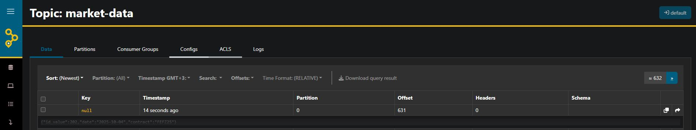 |
| 2 | Проверить логи consumer на ошибки валидации | В логах consumer есть ошибки валидации обязательных полей | WARNING: Отсутствует обязательное поле: price. Сообщение пропущено | ✅ PASS | [Логи](../test_results/TC-KAFKA-007_step2_consumer_logs.txt) |

**Статус:** ✅ Manual ✅ PASSED - Валидация обязательных полей работает корректно

---

### TC-KAFKA-008: TC-KAFKA-008: Invalid JSON Handling

| Шаг | Действие | Ожидаемый результат | Фактический результат | Статус | Доказательства |
|-----|----------|---------------------|----------------------|--------|----------------|
| 1 | Отправить сообщение с невалидным JSON через AKHQ | Сообщение успешно отправлено в топик market-data | Сообщение успешно отправлено | ✅ PASS | 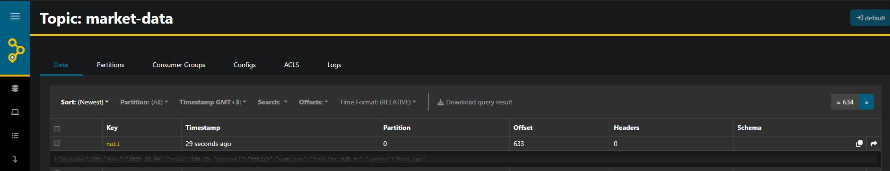 |
| 2 | Проверить логи consumer на ошибки парсинга | В логах consumer есть ошибки парсинга JSON | Consumer упал с ошибкой JSONDecodeError | ❌ FAIL | [Логи](../test_results/TC-KAFKA-008_step2_consumer_logs.txt) |

**Статус:** ✅ Manual ❌ FAILED - Найден критический баг (BUG-KAFKA-008)

---
### TC-KAFKA-009: Empty Message Handling

| Шаг | Действие | Ожидаемый результат | Фактический результат | Статус | Доказательства |
|-----|----------|---------------------|----------------------|--------|----------------|
| 1 | Отправить пустое сообщение через AKHQ | Сообщение успешно отправлено в топик market-data | ✅ Сообщение успешно отправлено | PASS | 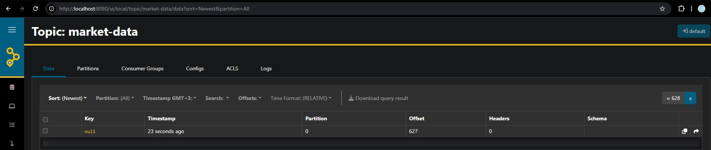 |
| 2 | Проверить логи consumer на обработку пустого сообщения | В логах consumer присутствуют ошибки валидации пустого сообщения | ✅ ERROR Empty payload, сообщение пропущено | PASS | [Логи](../test_results/TC-KAFKA-009_step2_consumer_logs.txt) |

**Статус:** ✅ Manual ✅ PASSED - Обработка пустых сообщений работает корректно

---
### TC-KAFKA-010: Large Message Handling

| Шаг | Действие | Ожидаемый результат | Фактический результат | Статус | Доказательства |
|-----|----------|---------------------|----------------------|--------|----------------|
| 1 | Отправить большое сообщение через AKHQ | Сообщение успешно отправлено в топик market-data | ✅ Сообщение успешно отправлено | PASS | 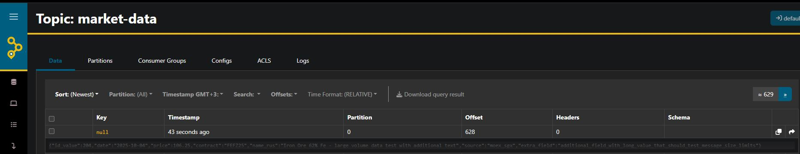 |
| 2 | Проверить что сообщение обработано без ошибок | В логах consumer отсутствуют ошибки обработки | ✅ Сообщение #629 получено и сохранено | PASS | [Логи](../test_results/TC-KAFKA-010_step2_consumer_logs.txt) |

**Статус:** ✅ Manual ✅ PASSED - Обработка больших сообщений работает корректно

---
# ШАБЛОНЫ
✅ PASS - все ок  
❌ FAIL - тест не прошел  
⏹️ BLOCKED - заблокирован багом/зависимостью  
🟡 WARNING - есть проблемы, но не критичные  

---

## 🐛 Bugs Found

## 📈 Metrics
- **Test Coverage**: 
- **Execution Progress**: 
- **Critical Issues**: 
